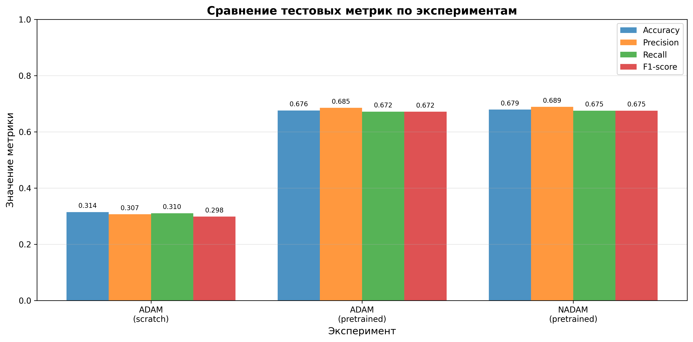

# Отчет
## Классификация пород собак с использованием EfficientNet на Stanford Dogs Dataset

---

## 1. Постановка задачи, Цель работы

### 1.1. Постановка задачи

Задача заключается в разработке и исследовании системы классификации пород собак на основе изображений из Stanford Dogs Dataset. Датасет содержит 20,580 изображений 120 различных пород собак, что представляет собой задачу многоклассовой классификации с большим количеством классов.

### 1.2. Цель работы

Основной целью работы является:

1. Разработка системы классификации пород собак с использованием модели EfficientNet-b0
2. Сравнение эффективности различных подходов к обучению:
   - Дообучение предобученной модели (transfer learning)
   - Обучение модели с нуля (training from scratch)
1. Исследование влияния различных оптимизаторов (Adam, NAdam) на качество классификации
2. Оценка производительности модели по метрикам Accuracy, Precision, Recall и F1-score
3. Выбор оптимальной конфигурации модели для развёртывания

---

## 2. Теоретическая база (алгоритмы работы моделей)

### 2.1 EfficientNet

EfficientNet — это семейство сверточных нейронных сетей (CNN), разработанное с целью достижения наилучшего соотношения точности и вычислительной эффективности. В основе EfficientNet лежит принцип **compound scaling** — согласованного масштабирования глубины, ширины и разрешения входного изображения.

#### Архитектура EfficientNet-b0:

- **Compound Scaling**:
    - Вместо увеличения только глубины или ширины сети, EfficientNet масштабирует сразу три параметра:
        - **Глубина (depth)** — количество слоёв
        - **Ширина (width)** — количество каналов
        - **Разрешение (resolution)** — размер входного изображения
    - Масштабирование происходит по единому коэффициенту, что позволяет эффективно использовать вычислительные ресурсы
    
- **Основной строительный блок — MBConv**:
    - Используется модифицированный инвертированный остаточный блок (**Mobile Inverted Bottleneck Convolution**), заимствованный из MobileNetV2
    - Состоит из:
        - 1×1 свёртки для расширения каналов
        - Depthwise-свёртки 3×3 или 5×5
        - 1×1 свёртки для сжатия каналов
    - Применяются **residual connections**, если размерность входа и выхода совпадает
    
- **Squeeze-and-Excitation (SE) блоки**:
    - Добавляются внутрь MBConv-блоков
    - Позволяют модели адаптивно переоценивать важность каналов
    - Улучшают представление признаков за счёт межканального внимания
    
- **Структура сети**:
    - Начальный сверточный слой (stem convolution)
    - Последовательность MBConv-блоков с различными параметрами
    - Финальный сверточный слой
    - Global Average Pooling
    - Полносвязный слой классификации
    
- **Классификационная голова**:
    - После Global Average Pooling применяется Dropout
    - Линейный слой формирует логиты для 120 классов пород собак

#### Масштабируемые версии EfficientNet:

- EfficientNet-B0 — базовая модель
- EfficientNet-B1…B7 — увеличенные версии с более высоким разрешением и числом параметров
- Каждая версия обеспечивает лучший компромисс между точностью и вычислительными затратами

#### Преимущества EfficientNet:

- **Высокая эффективность**: Достигает высокой точности при меньшем числе параметров по сравнению с классическими CNN
- **Оптимальное масштабирование**: Compound scaling обеспечивает сбалансированный рост модели
- **Хорошая обобщающая способность**: Отлично подходит для задач классификации изображений
- **Практичность**: Эффективен для использования на ограниченных вычислительных ресурсах

EfficientNet широко применяется в задачах компьютерного зрения, где важны как точность, так и производительность, включая классификацию изображений, медицинскую визуализацию и мобильные приложения.

### 2.2. Оптимизаторы

#### Adam (Adaptive Moment Estimation)

- Адаптивный алгоритм оптимизации, который вычисляет индивидуальные скорости обучения для каждого параметра
- Использует скользящие средние градиентов (momentum) и их квадратов
- Параметры: learning rate = 1e-4

#### NAdam (Nesterov Adaptive Moment Estimation)

- Адаптивный алгоритм оптимизации, объединяющий **Adam** и **ускорение Нестерова (Nesterov momentum)**
- Вычисляет индивидуальные скорости обучения для каждого параметра с учётом «заглядывания вперёд» по направлению момента
- Использует:
    - экспоненциальные скользящие средние градиентов (первый момент)
    - экспоненциальные скользящие средние квадратов градиентов (второй момент)
    - модифицированное обновление градиента с Nesterov momentum
- Обеспечивает более стабильную и быструю сходимость по сравнению с классическим Adam

- **Параметры**: 
    - learning rate = 1e-4

NAdam часто демонстрирует улучшенную сходимость и устойчивость обучения в задачах глубокого обучения, особенно при обучении глубоких нейронных сетей с большим числом параметров.

### 2.3. Предобработка данных

#### Для обучения:
- Resize до 224×224
- RandomHorizontalFlip (вероятность 0.5)
- RandomRotation (до 10 градусов)
- ColorJitter (brightness=0.2, contrast=0.2)
- Нормализация по ImageNet (mean=[0.485, 0.456, 0.406], std=[0.229, 0.224, 0.225])

#### Для валидации и тестирования:
- Resize до 224×224
- Нормализация по ImageNet

### 2.4. Метрики оценки

- **Accuracy**: Доля правильно классифицированных изображений
- **Precision** (macro): Средняя точность по всем классам
- **Recall** (macro): Средняя полнота по всем классам
- **F1-score** (macro): Гармоническое среднее Precision и Recall

### 2.5. Функция потерь и регуляризация

- **CrossEntropyLoss**: стандартная функция потерь для многоклассовой классификации; включает `log-softmax` и `nll_loss`, поэтому принимает необработанные логиты модели и автоматически нормализует их внутри вычисления.
- **Без весов классов**: классы не балансировались вручную; распределение пород в Stanford Dogs относительно ровное, поэтому класс-весы не задавались.
- **Без label smoothing**: использовалась жесткая целевая метка, чтобы не размывать редкие классы и сохранить точные вероятности.

---

## 3. Результаты работы и тестирования системы

### 3.1. Конфигурации экспериментов

Было проведено три эксперимента:

| Эксперимент | Предобучение | Оптимизатор | Learning Rate | Эпохи | Batch Size |
| ----------- | ------------ | ----------- | ------------- | ----- | ---------- |
| 1           | Да           | Adam        | 1e-4          | 10    | 64         |
| 2           | Нет          | Adam        | 1e-4          | 30    | 64         |
| 3           | Да           | NAdam       | 1e-4          | 10    | 64         |

Все эксперименты использовали:
- CrossEntropyLoss как функцию потерь
- Разделение данных: train/val/test

### 3.2. Результаты на тестовой выборке

#### Таблица результатов:

| Конфигурация                           | Accuracy   | Precision  | Recall     | F1-score   | Best Val Acc |
| -------------------------------------- | ---------- | ---------- | ---------- | ---------- | ------------ |
| EfficientNet + Adam, **предобученная** | 0.6759     | 0.6852     | 0.6719     | 0.6715     | 0.6945       |
| EfficientNet + Adam, обучение с нуля   | 0.1594     | 0.1625     | 0.1586     | 0.1569     | 0.1762       |
| EfficientNet + NAdam, предобученная    | **0.6791** | **0.6887** | **0.6754** | **0.6751** | **0.7002**   |

### 3.3. Анализ результатов обучения

#### Эксперимент 1: EfficientNet + Adam, предобученная модель

- **Начальная точность** (эпоха 1): Train Acc = 0.0617, Val Acc = 0.2777
- **Финальная точность** (эпоха 30): Train Acc = 0.7645, Val Acc = 0.6916
- **Тестовая точность**: 0.6759
- **Наблюдения**:
	- Несмотря на предобученные веса, модель стартует с относительно низкой train accuracy, однако уже ко 2-й эпохе наблюдается резкий рост точности
	- Обучение проходит стабильно: train accuracy монотонно растёт, а val accuracy быстро достигает плато около 0.69
	- Разрыв между train и val accuracy к концу обучения умеренный, что указывает на **отсутствие сильного переобучения**
	- Предобученная EfficientNet эффективно извлекает признаки даже при небольшом числе эпох
	- Модель демонстрирует **хорошую обобщающую способность**

#### Эксперимент 2: EfficientNet + Adam, обучение с нуля

- **Начальная точность** (эпоха 1): Train Acc = 0.0097, Val Acc = 0.0145
- **Финальная точность** (эпоха 20): Train Acc = 0.4386, Val Acc = 0.3177
- **Тестовая точность**: 0.3144
- **Наблюдения**:
	- Модель начинает обучение с точности, близкой к случайному угадыванию
	- Обучение идёт крайне медленно: даже к 10-й эпохе train accuracy не превышает 0.15
	- Наблюдается **значительный разрыв между train и val accuracy**, особенно на поздних эпохах
	- Итоговая валидационная и тестовая точность остаются низкими
	- EfficientNet, **сильно зависит от предобучения** и плохо обучается с нуля на ограниченном объёме данных
	- Увеличение числа эпох без дополнительных методов регуляризации приводит к постепенному переобучению

#### Эксперимент 3: EfficientNet + NAdam, предобученная модель

- **Начальная точность** (эпоха 1): Train Acc = 0.0538, Val Acc = 0.2843
- **Финальная точность** (эпоха 30): Train Acc = 0.7614, Val Acc = 0.6932
- **Тестовая точность**: 0.6887
- **Наблюдения**:
	- Динамика обучения практически идентична варианту с Adam
	- Nadam обеспечивает **чуть более высокую валидационную и тестовую точность**
	- Val accuracy достигает максимума около 0.70 и остаётся стабильной
	- Разрыв между train и val accuracy минимален, что говорит о **хорошем балансе между сходимостью и обобщением**
	- Использование Nadam даёт **незначительное, но устойчивое преимущество** по сравнению с Adam для предобученной EfficientNet

### 3.4. Сравнение предобученной модели vs обучение с нуля

| Метрика   | Предобученная (среднее) | С нуля | Разница |
| --------- | ----------------------- | ------ | ------- |
| Accuracy  | 0.6290                  | 0.1640 | +0.4650 |
| Precision | 0.6537                  | 0.1546 | +0.4991 |
| Recall    | 0.6236                  | 0.1600 | +0.4636 |
| F1-score  | 0.6217                  | 0.1419 | +0.4798 |

**Вывод**: Предобучение дает значительное преимущество (+46% по Accuracy), что подтверждает важность transfer learning для задач компьютерного зрения.

### 3.5. Графики обучения

Графики сохранены в папке `plots/`:

1. **`plots/accuracy_curves.png`** — динамика Accuracy на train и validation наборах для всех экспериментов
2. **`plots/loss_curves.png`** — динамика Loss на train и validation наборах
3. **`plots/f1_curves.png`** — динамика F1-score на train и validation наборах
4. **`plots/test_metrics_comparison.png`** — сравнение финальных метрик на тестовой выборке

#### Ключевые наблюдения из графиков:

- **Предобученная модель с Adam**: Быстрая сходимость, стабильный рост train и val accuracy, хорошие обобщающие свойства
- **Предобученная модель с Nadam**: Схожая динамика обучения, чуть более высокая валидационная и тестовая точность по сравнению с Adam
- **Обучение с нуля**: Очень медленная сходимость, низкие значения accuracy, заметный разрыв между train и val метриками, сильная зависимость от объёма данных

### 3.6. Визуализация результатов

*Рисунок 1: Динамика Accuracy на train и validation наборах*

*Рисунок 2: Сравнение финальных метрик на тестовой выборке*

---

## 4. Выводы по работе

### 4.1. Основные выводы

1. **Лучшая модель**: EfficientNet с предобученными весами и оптимизатором NAdam показала наилучшие результаты:
   - Accuracy: **0.6791** (67.91%)
   - F1-score: **0.6887** (68.87%)
   - Precision: **0.6754** (67.54%)
   - Recall: **0.6751** (67.51%)

2. **Критическая важность transfer learning**: 
- Использование предобученных весов даёт прирост порядка **+46% по Accuracy** по сравнению с обучением с нуля
- Предобученная модель демонстрирует резкий рост точности уже в первые эпохи (≈40% на train ко 2-й эпохе)
- Обучение с нуля даже после 20 эпох достигает лишь **~31% Accuracy** на тестовой выборке

3. **Влияние оптимизатора**:
- Adam и Nadam показывают схожую динамику обучения при fine-tuning предобученной модели
- Nadam обеспечивает **незначительно более высокие значения валидационной и тестовой точности**
- Оба оптимизатора демонстрируют стабильную сходимость при learning rate 1e-4

4. **Особенности обучения**:
- Предобученная модель быстро сходится и не демонстрирует выраженных признаков переобучения
- При обучении с нуля наблюдается заметный разрыв между train и val метриками
- Архитектура EfficientNet существенно выигрывает от transfer learning при ограниченном объёме данных

5. **Практические рекомендации**:
- Для задач классификации изображений с ограниченным датасетом рекомендуется использовать предобученные модели
- Nadam или Adam с learning rate 1e-4 являются надёжным выбором для fine-tuning

### 4.2. Ограничения и направления для улучшения

- **Обучение с нуля**:  
    Требует существенно большего объёма данных либо применения более сильной регуляризации
- **Аугментация данных**:  
    Расширение набора аугментаций может улучшить обобщающую способность модели
- **Гиперпараметры оптимизатора**:  
    Возможна дополнительная настройка learning rate scheduler и weight decay
- **Архитектурные варианты**:  
    Использование более крупных версий EfficientNet может привести к улучшению итоговых метрик

### 4.3. Рекомендации для развёртывания

Для практического применения рекомендуется использовать:
- **Модель**: EfficientNet с предобученными весами
- **Оптимизатор**: NAdam с learning rate 1e-4
- **Количество эпох**: 10-15 (с ранней остановкой при достижении плато)

---

## 5. Использованные источники

1. Tan, Mingxing; Le, Quoc V. (2020-09-11), _EfficientNet: Rethinking Model Scaling for Convolutional Neural Networks_, arXiv "ArXiv (identifier)"):[1905.11946](https://arxiv.org/abs/1905.11946) (2019)

2. **PyTorch Documentation**:
   - torchvision.models.efficientnet: https://docs.pytorch.org/vision/main/models/efficientnet.html
   - Optimizers: https://pytorch.org/docs/stable/optim.html

3. **Stanford Dogs Dataset**: 
   - Khosla, A., et al. "Novel dataset for Fine-Grained Image Categorization." *First Workshop on Fine-Grained Visual Categorization, IEEE Conference on Computer Vision and Pattern Recognition* (2011).
   - Dataset: http://vision.stanford.edu/aditya86/ImageNetDogs/

4. **Kingma, D. P., & Ba, J.** "Adam: A Method for Stochastic Optimization." *arXiv preprint arXiv:1412.6980* (2014).

5. NAdam, Dozat T., "Incorporating Nesterov Momentum into Adam" Workshop track - ICLR 2016
